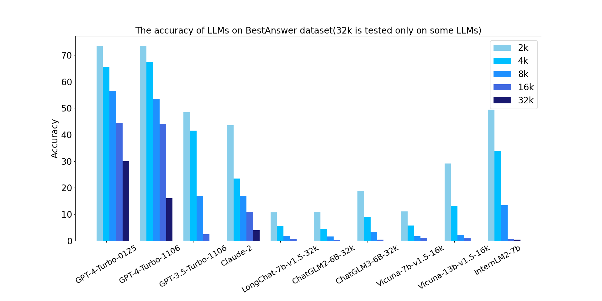
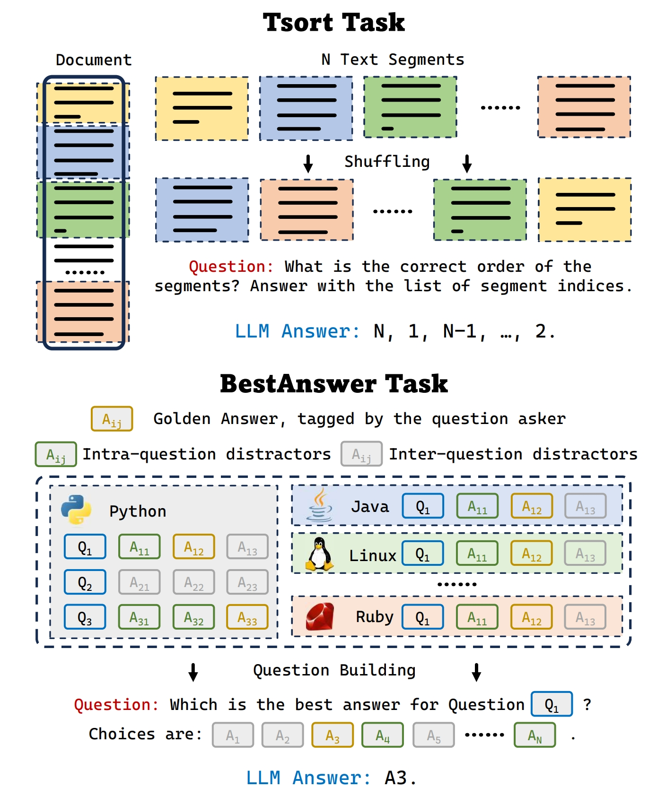

# Ada-LEval

**The official implementation of ["Ada-LEval: Evaluating long-context LLMs with length-adaptable benchmarks"](https://arxiv.org/abs/2404.06480)**

<p align="center">
  
</p>

**Ada-LEval** is a pioneering benchmark to assess the long-context capabilities with length-adaptable questions. It comprises two challenging tasks: **TSort**, which involves arranging text segments into the correct order, and **BestAnswer**, which requires choosing the best answer of a question among multiple candidates.

Both tasks feature the following advantages:
1. **Controllable Test Cases**: The length of each test case can be finely tuned - by adjusting the number and length of text segments in TSort and altering the number of distractor options in BestAnswer. 
2. **Necessity for Full-Text Comprehension**: Successful completion of both tasks mandates complete reading and understanding of the provided text.
3. **Precise Accuracy Measurement**: The design of these tasks allows for unambiguous accuracy calculation. TSort has a definitive 'correct' order, while in BestAnswer, the annotated responses by the questioner serve as definitive answers.

<p align="center">
  
</p>

## 🛠️QuickStart

In this repo, we implement the evaluation of Ada-LEval on GPT-4-Turbo-0125 (an example for APIs) and internlm2-[7b/20b] (an example for opensource LLMs). You can follow our implementation to evaluate Ada-LEval on your custom LLMs. 

1. **Preparation**

   1. Installation and data preparation

      ```bash
      cd Ada-LEval
      pip install -e . 
      bash fetch_data.sh
      ```

   2. For evaluating GPT-4, please set the environment variable: `export OPENAI_API_KEY=sk-xxxxx`

      - Cost Estimation for GPT-4-Turbo-0125: `setting (2k, 4k, etc.) * n_samples * $0.01 / 1000`

   3. For evaluating InternLM2-7B, please follow the [official guide](https://github.com/InternLM/lmdeploy) to install LMDeploy. 

2. **Evaluate GPT-4-Turbo-0125**: `python run.py --data {dataset_name} --model gpt-4-0125`

3. **Evaluate InternLM2-7B**: `bash run.sh --data {dataset_name} --model internlm2-7b`

\* `dataset_name` can be `stackselect_{setting}` (for **BestAnswer**) or `textsort_{setting}` (for **TSort**). For example, `stackselect_16k`, `textsort_2k`, etc.

\** `run.sh` detect the number of available GPUs and do the data parallel. 

## 📊Evaluation Result
Here is the evaluation result of TSort and BestAnswer benchmark under **long-context** & **ultra-long-context** settings. We also provide a 'random guess' baseline for each task. 

**Definition:** long-context  ->  context window < 32k; ultra-long-context: context-window >= 32k

**The Number of Evaluation Samples:** 1. API models on long-context: 200; 2. API models on ultra-long-context: 50; 3. Open-source models on long-context: 1000; 4. Open-source models on ultra-long-context: 200. 

#### TL;DR: 

1. **TSort is an extremely challenging benchmark:** We observe positive results (significantly better than random guess) only when evaluating SOTA API models (GPT-4 series) under short context settings (< 8k).
2. **BestAnswer is a challenging long-context benchmark with discrimination:** With 32k long-context, GPT-4-Turbo-0125 still obtains a decent 30% accuracy, while other models significantly lag behind. When the context window is 64k or even longer, models failed to solve almost all of the questions. 

#### TSort Evaluation Results

Blanks indicate the result under the corresponding setting is not evaluated. 

| TSort                | 2k   | 4k   | 8k   | 16k  | 32k  | 64k  | 128k |
| -------------------- | ---- | ---- | ---- | ---- | ---- | ---- | ---- |
| GPT-4-Turbo-0125     | 15.5 | 16.5 | 8.5  | 5.5  | 2.0  | 4.0  | 2.0  |
| GPT-4-Turbo-1106     | 18.5 | 15.5 | 7.5  | 3.5  | 6.0  | 6.0  | 6.0  |
| GPT-3.5-Turbo-1106   | 4.0  | 4.5  | 4.5  | 5.5  |      |      |      |
| Claude-2             | 5.0  | 5.0  | 4.5  | 3.0  | 0.0  | 0.0  |      |
| LongChat-7b-v1.5-32k | 5.3  | 5.0  | 3.1  | 2.5  |      |      |      |
| ChatGLM2-6B-32k      | 0.9  | 0.7  | 0.2  | 0.9  |      |      |      |
| ChatGLM3-6B-32k      | 2.3  | 2.4  | 2.0  | 0.7  |      |      |      |
| Vicuna-7b-v1.5-16k   | 5.3  | 2.2  | 2.3  | 1.7  |      |      |      |
| Vicuna-13b-v1.5-16k  | 5.4  | 5.0  | 2.4  | 3.1  |      |      |      |
| InternLM2-7b         | 5.1  | 3.9  | 5.1  | 4.3  |      |      |      |
| Random Guess         | 4.2  | 4.2  | 4.2  | 4.2  | 4.2  | 4.2  | 4.2  |

#### BestAnswer Evaluation Results

Blanks indicate the result under the corresponding setting is not evaluated. 

| BestAnswer           | 1k   | 2k   | 4k   | 6k   | 8k   | 12k  | 16k  | 32k  | 64k  | 128k |
| -------------------- | ---- | ---- | ---- | ---- | ---- | ---- | ---- | ---- | ---- | ---- |
| GPT-4-Turbo-0125     | 73.5 | 73.5 | 65.5 | 63.0 | 56.5 | 52.0 | 44.5 | 30.0 | 0.0  | 0.0  |
| GPT-4-Turbo-1106     | 74.0 | 73.5 | 67.5 | 59.5 | 53.5 | 49.5 | 44.0 | 16.0 | 0.0  | 0.0  |
| GPT-3.5-Turbo-1106   | 61.5 | 48.5 | 41.5 | 29.5 | 17.0 | 2.5  | 2.5  |      |      |      |
| Claude-2             | 65.0 | 43.5 | 23.5 | 15.0 | 17.0 | 12.0 | 11.0 | 4.0  | 0.0  |      |
| LongChat-7b-v1.5-32k | 32.4 | 10.7 | 5.7  | 3.1  | 1.9  | 1.6  | 0.8  |      |      |      |
| ChatGLM2-6B-32k      | 31.2 | 10.9 | 4.5  | 1.6  | 1.6  | 0.0  | 0.3  |      |      |      |
| ChatGLM3-6B-32k      | 39.8 | 18.8 | 9.0  | 5.0  | 3.4  | 0.9  | 0.5  |      |      |      |
| Vicuna-7b-v1.5-16k   | 37.0 | 11.1 | 5.8  | 3.2  | 1.8  | 1.9  | 1.0  |      |      |      |
| Vicuna-13b-v1.5-16k  | 53.4 | 29.2 | 13.1 | 4.3  | 2.2  | 1.4  | 0.9  |      |      |      |
| InternLM2-7b         | 58.6 | 49.5 | 33.9 | 12.3 | 13.4 | 2.0  | 0.8  | 0.5  | 0.5  | 0.0  |
| Random Guess         | 26.7 | 10.1 | 4.5  | 3.0  | 2.3  | 1.4  | 1.1  | 0.6  | 0.3  | 0.1  |

## 🖊️Citation

```bib
@misc{wang2024adaleval,
      title={Ada-LEval: Evaluating long-context LLMs with length-adaptable benchmarks}, 
      author={Chonghua Wang and Haodong Duan and Songyang Zhang and Dahua Lin and Kai Chen},
      year={2024},
      eprint={2404.06480},
      archivePrefix={arXiv},
      primaryClass={cs.CL}
}
```
